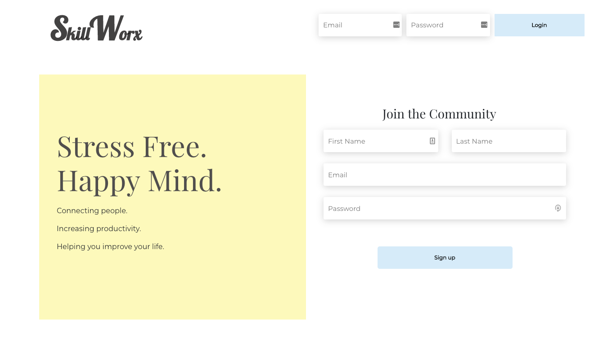

# SkillWorx
> SkillWorx is a platform that connects you with trustworthy people who can help with odd jobs.

## General Info
The aim of this project was to build something within the span of a week that we thought would be useful and challenging, and also met all of the requirements for our final project at a Full Stack Coding Bootcamp. It was meant to be the culmination of all of the skills we learned over course of 12 weeks.

The requirements:
* ReactJS
* NodeJS + Express Web Server
* MySQL + Sequelize or MongoDB + Mongoose ORM
* GET and POST routes
* Heroku
* User authentication
* Polished UI
* MVC Paradigm folder structure

## Screenshots

## Technologies
* **NodeJS** + **ExpressJS** - Backend Web Server
* **ReactJS** - The JS frontend framework
* **Bootstrap 4** - Frontend
* **MongoDB + Mongoose** - Database
* **Socket.IO** - Chat
* **Heroku** - Deployment

## Launch
Head over to [https://skillworx.herokuapp.com/](https://skillworx.herokuapp.com) and sign up!

## Status
MVP (Work in progress)

__To Do:__
* Perfect chat system
* Add ability to make payments
* Add rating system
* Image hosting for profiles and posting
* Ability to save jobs and workers
* Fix cards

## Authors

* **[Desmond Rogers](https://github.com/dezrogers)** - *Backend Development*
* **[Barbara Ontiveros](https://github.com/Barbi105)** - *UX/UI, Frontend Development, Authentication*
* **[Ulises Rangel](https://github.com/urangel)** - *Frontend Development*

See also the list of [contributors](https://github.com/dezrogers/skillworx/graphs/contributors) who participated in this project.

## Acknowledgments

* Hat tip to [Paul Pagnan](https://github.com/paul-pagnan) for building `react-instant-chat`. It helped us grasp socket.IO and make the chat feature functional.
* Inspired by: Taskrabbit and experiences with Craigslist job postings in 'etc/misc'.

